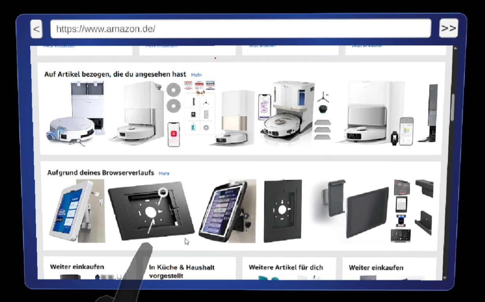

# ✨ MixedRealityToolkit-MRTK3-WebView2-Hololens2

This Unity project demonstrates advanced hand gesture-based interactions for navigating webpages in **WebView2**, designed specifically for **HoloLens2** using **MRTK3** and **XR Interaction Toolkit**. Also, refer to the officiali documentation on [Getting started with WebView2 in HoloLens 2 Unity apps](https://learn.microsoft.com/en-us/microsoft-edge/webview2/get-started/hololens2) 

While the default WebView2 prefab supports basic browser controls (like back, forward, and URL input), this project enhances usability with **natural hand gestures** — making browsing in mixed reality more intuitive and immersive.

---

## 📌 Features

- 🔗 Full integration with **WebView2** in Unity
- 🖱️ Click webpage content using:
  - Far-ray pinch gesture
  - Near-poke (touch) interaction
- 📜 Scroll webpage using far-ray swipe gesture (hand motion up/down)
- 🧩 Plug-and-play Unity components (scripts)
- ✅ Compatible with MRTK3 and OpenXR-based hand tracking
- 🎮 Demo scene included: `WebviewDemo.unity`

---

## 🎬 Demo Videos
📽 **General Demo – WebView2 Interactions in MR**  
Demonstrates all interaction types while navigating a webpage in mixed reality.
[](https://drive.google.com/file/d/1AlJrVqLrV5DMvV4bO2Ha2ak6nxNUejKp/view?usp=sharing)  

📽 **Click Interaction Showcase**  
Focuses specifically on the two available modes of clicking:

- Far-ray + pinch
- Near-poke (touch)

---

## 🛠️ How to Use

### Option 1: Try the Demo Scene

The easiest way to explore the features is to open:

> `Assets/Scenes/WebviewDemo.unity`

This scene includes all components wired up and ready to test.

---

### Option 2: Add to Your Own Scene

#### 1. Add WebView2 to the Scene

Follow the official WebView2 Unity integration guide to:

- Add the **WebView2 prefab** to your scene
- Attach `WebViewBrowser.cs` to the prefab
- Hook up:
  - Back button
  - Forward button
  - URL field (TextMeshPro)

#### 2. Add Gesture Interaction Scripts

To enable advanced interactions, add the following components to the WebView GameObject:

- `ClickInteractable.cs`  
  Enables clicking via:
  - Far-ray + pinch
  - Near-poke (touch)

- `FarRaySwipeInteractable.cs`  
  Enables scrolling by far-ray **hand swipe up/down** gesture

📁 Scripts are located at:

```
├── Assets
│   ├── Scripts
│   ├── ├── HandGestureInteraction
│   ├── ├── ├── WebViewInteractables
│   ├── ├── ├── ├── FarRaySwipeInteracatable.cs
│   ├── ├── ├── ├── ClickInteracatable.cs

```

#### 3. Add `PressableButton.cs`

To register hand gestures as interactions, ensure your WebView GameObject also includes:

- `PressableButton.cs` (MRTK3 component)


---

## ✋ Interaction Overview

| Action          | Gesture                   | Interaction Type     |
|------------------|----------------------------|------------------------|
| Click webpage    | Far-ray + pinch gesture    | Far interaction        |
| Click webpage    | Touch / near-poke          | Near interaction       |
| Scroll page      | Hand swipe (up/down)       | Far-ray gesture        |

These interactions are designed with natural HoloLens2 usage in mind and are fully compatible with **hand-tracking** via **OpenXR** and **MRTK3**'s XR Interactables.

---

## 🙌 Credits

Although documentation on integrating WebView2 with HoloLens2 and MRTK3 is still limited, several community contributions, GitHub discussions, and blog posts were instrumental in guiding this implementation.

Special thanks to the authors and contributors of the following resources:

- 🐞 **GitHub Issue**:  
  _"WebView causes HoloLens2 App to crash after updating Unity project to MRTK3"_  
  [WebView2Feedback Issue #4380](https://github.com/MicrosoftEdge/WebView2Feedback/issues/4380)

- 📁 **Official Sample Repository**:  
  _Getting started with WebView2 in Unity for HoloLens 2 with MRTK2_  
  [WebView2Samples – HoloLens2 Getting Started](https://github.com/MicrosoftEdge/WebView2Samples/tree/main/GettingStartedGuides/HoloLens2_GettingStarted)

- 📝 **Blog Post** by LocalJoost:  
  _"MRTK2 to MRTK3 – A MUCH SIMPLER way to intercept a raw air tap like with IMixedRealityPointerHandler"_  
  [Read the article](https://localjoost.github.io/MRTK2-to-MRTK3-a-MUCH-SIMPLER-way-to-intercept-a-raw-air-tap-like-with-IMixedRealityPointerHandler/)

---